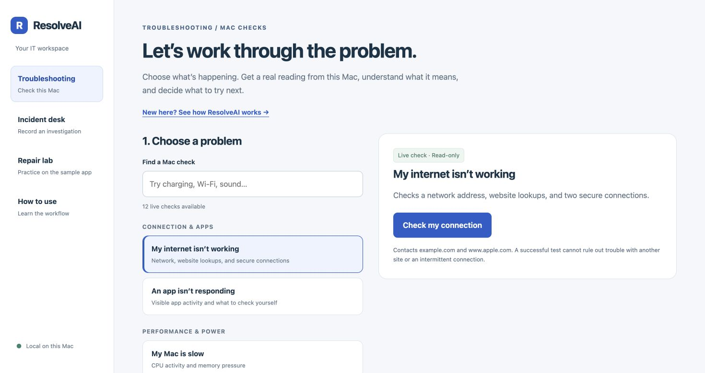
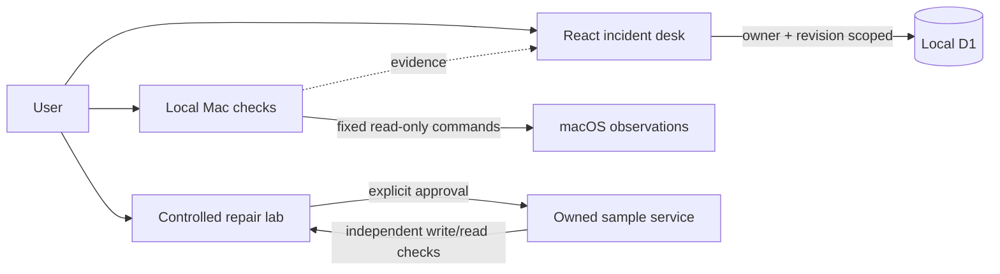

# ResolveAI

A local IT troubleshooting portfolio project: observe a problem, explain the evidence, record an investigation, and verify the outcome.

**Scope frozen for the portfolio release:** 12 read-only Mac checks, 17 guided procedures, and a controlled service-repair lab. Some topics overlap; these are workflows, not 29 independently diagnosed root causes.

## Screenshots



[Guided procedure](docs/screenshots/guided-procedure.png) · [Controlled repair lab](docs/screenshots/repair-lab.png)

Screenshots show the local interface without personal records or device identifiers. The repair screenshot shows normal operation, not a repair in progress.

## Start here

Requires macOS for live device checks, Node.js 22.13+, and pnpm.

```sh
pnpm install
node scripts/start-local.mjs
```

On macOS you can also double-click **Start Local Lab.command** after installing dependencies. Keep that Terminal window open. The launcher applies local database migrations, starts missing services, waits for readiness, and reuses recognized running services. Control-C stops only services it started. It does not install a background login service; run it again after reboot or closing Terminal.

Open [ResolveAI](http://resolveai.localhost:4318/), or use the [numeric fallback](http://127.0.0.1:4318/). This is a local address, not a public website. The incident desk uses port 3000, diagnostics use 4318, and the owned sample service uses 4319.

If Mac checks stop working while guided procedures still open, run the launcher again: they use separate services. An occupied or unresponsive port is reported; the launcher never kills an unrelated process.

## Navigate the app

| Section | What you do |
| --- | --- |
| Troubleshooting / Mac checks | Choose a symptom, run a read-only check, inspect evidence, and recheck after your next step. |
| Incident desk / Guided procedures | Record your observations, follow a relevant next step, verify the original task, and save the investigation. |
| Repair lab | Practice controlled failure, diagnosis, explicit approval, and independent write/read verification on the owned sample service. |
| How to use | Follow the short walkthrough. |

For local incident saving, visit `/signin-with-chatgpt?return_to=/` on port 3000 for the starter’s development identity. No paid AI calls are needed for the core demonstration.

## Five-minute demonstration

1. Open Mac checks and run **I’m low on storage**. Explain what the reading establishes and what it cannot prove.
2. Open guided procedures, search **meeting**, and record a clearly labeled demonstration observation. Save an investigation and show its incident record.
3. Open the repair lab. Introduce a supported fault on its sample service, inspect evidence, review the proposed repair, approve it, and inspect verification results.
4. Explain the distinction between host observations, user-reported observations, and synthetic lab workloads.

## Architecture and engineering decisions

- A loopback Node service executes bounded, fixed read-only Mac diagnostics; request input cannot supply arbitrary commands.
- The React incident desk uses local Cloudflare D1 storage, owner-scoped queries, and revision checks to prevent stale updates.
- The lab owns its child service and SQLite test workload. Repairs have scoped approvals, expiry, preconditions, and independent verification.
- Optional AI analyzes supplied evidence; it cannot execute repairs. Its accuracy has not been established by a held-out evaluation.



See [technical reference](docs/TECHNICAL.md), [user walkthrough](HOW-TO-USE.md), and [release notes](docs/RELEASE.md).

## Validation and limitations

```sh
pnpm test
pnpm typecheck
pnpm lint
pnpm build
```

| Check | Current result |
| --- | --- |
| Automated tests | 96 passed |
| TypeScript | Passed |
| Full-project lint | Passed |
| Production build | Passed |

Live integration scripts in `tests/` require running local services. Some deliberately create synthetic records and inject faults into the owned sample service; they are not tests to run against production. Paid AI checks are separate and optional.

This is a portfolio prototype, not an enterprise endpoint-management product. Mac checks do not apply general repairs. Camera and microphone guides do not activate those devices. Physical printer and external-drive recovery have not been validated. Results can be unavailable in restricted launch environments. Local records are not synchronized with the older hosted version. Never import confidential workplace logs or credentials.
